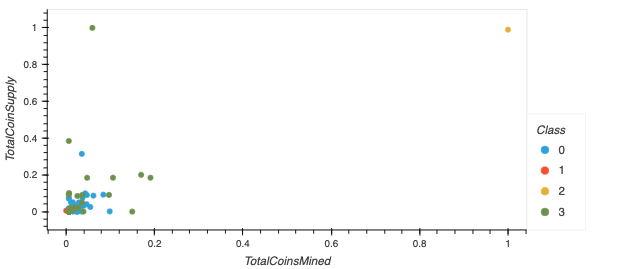

# Cryptocurrencies

## Overview of Analysis and Purpose
An investment bank is looking to offer a new cryptocurrency investment portfolio for its customers. A report has been created to present the cryptocurrencies available on the trading market. An unsupervised machine learning model will be used to cluster the data and create a classification system.

## Results and Summary
The cryptocurrency data was processed and prepared for PCA. Then the cryptocurrencies were clustered using K-means. This resulted in 4 distinct classes.  

